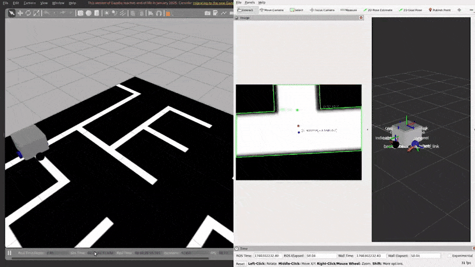
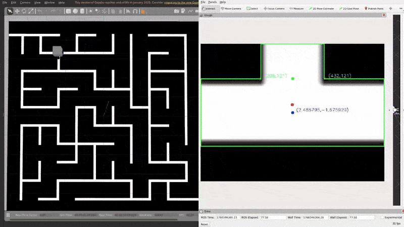
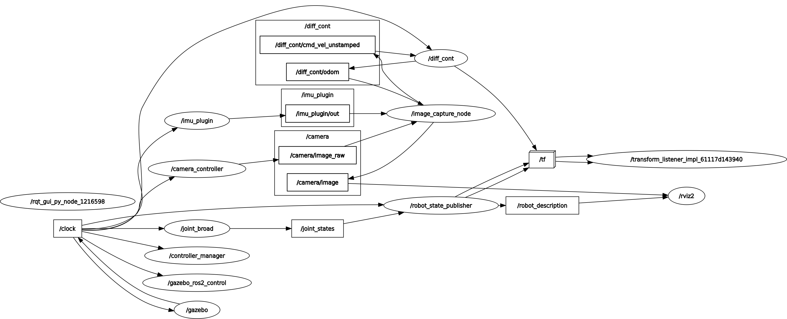

## Vision-Based Autonomous Maze Solving Robot Using Finite State Control and A\* Path Planning

---

### Overview

This project aspires to solve a problem which the industry generally prefers to
tackle through YOLO(you only look once) SOTA algorithm for bounding box markup and
object labelling and detection. While YOLO is popular it has its own problems
that comes complementary to it.

- Availability of Dataset (atleast 1000 images for good accuracy)
- Training time and Energy(Depending on the FOC score expected, image quality, hardware)
- Deployability in embedded applications (there are YOLO varients for this task)
- Slower

Hence, this project approaches this problem through the lens of OpenCV more particularly
Computer Vision.

---

### Results

I prefer to see the results before the explanation as that gives me the
patience to keep reading further if i find the project interesting.

So here are two videos sped up by a factor of _8_.

The first video is of maze image [5](Navigation_Bot/worlds/material/texture/5.png):


Next its the maze image [12](Navigation_Bot/worlds/material/texture/12.png):


You can try more examples (1000 mazes to be precise generated through "" Algorithm)

All you have to do is:

- Install as per the installation guide.
- navigate into the launch_sim.launch.py file within the launch folder.
- change the texture_name arguement to any whole number as guided.

```py
    # Include the Gazebo launch file, provided by the gazebo_ros package
    texture_name = "12"  # <--- CHANGE ME to change maze 0 to 1000

    world_path = os.path.join(
        get_package_share_directory(package_name), "worlds", "empty.world"
    )


```

- finally execute

```bash
ros2 launch navigation_bot launch_sim.launch.py
```

to launch the project.

---

### Installation

#### Prerequisites

- Installation of [CPP_GCC](https://gcc.gnu.org/install/) and [Pyhton](https://www.python.org/downloads/) on a compatible
  os is mandatory to run this project.(GCC compiler installation for linux)
- Make sure you have ROS2 humble installed.
  If not check out this guide from the official ROS2 HUMBLE distribution documentation:
  [ROS2 Humble](https://docs.ros.org/en/humble/Installation.html)
- This project is entirely based on OpenCV hence it is expected to download OpenCV
  version >= 4.9.0 for a hassle free experience.
  Here is a documentation to help you get up to speed on installing OpenCV:
  [OpenCV-CPP Installation Guide](https://docs.opencv.org/4.x/d7/d9f/tutorial_linux_install.html)
  [OpenCV-python Installation Guide](https://pypi.org/project/opencv-python/)

#### Project setup and build

```bash
mkdir ~/Navigation_bot/src/
cd ~/Navigation_Bot/src/
```

- Clone this repository preferably through ssh, just the main branch.

```bash
git clone -b main git@github.com:HrishikeshMRao/Navigation_Bot.git
```

- Use sudo if you are a superuser. To install workspace dependencies through rosdep
  for a seamless example run:

```bash
sudo apt update
sudo apt install python3-rosdep
sudo rosdep init  # only once
rosdep update
```

```bash
rosdep install --from-paths src --ignore-src -r -y
```

- Build it once to use it forever. ;)

```bash
cd ..
colcon build --symlink-install
```

### Methodology

#### Introduction

Before we go step by step over my contribution, Here is a quick graph to summarise
the flow of this project.


The image capture calls Astar function without ros interface hence not shown here.
Similarly launch file launches Convoluter.py file with image path parameters without
any ros2 topic interface.

#### Concepts

##### Maze Image Collection

Lets start with the Question i had in mind when i started this project
i.e. _How on earth do i create these Maze pictures?_. Well there is a cool algorithm
that generates mazes out of thin air. It is called _Randomized Kruskal's algorithm_.
Though, I have not included the code in this ROS project. I will provide with a
[Kaggle Repository](https://doi.org/10.34740/kaggle/dsv/4075361) i refferd for myimages. It conviniently provided with spanning
tree aswell which will be helpful as you will see while path planning.

---

#### Convoluter.py

Though the Maze folder was imported from kaggle. It could not be used directly as a texture.
The dataset was generated on a 10x10 grid hence both black and the white pixels were of same
width. This is not ideal for line following.

Hence a function was required that would:

- Decrease the width of white edges
- During the process not make the edges blurry.

The solution is a simple idea from my Computer vision class. "It has to be max pooling".
Well thats true but we have an option to erode or dialate.

- If we dialate the blacks : corners were seen to be more prominent but blurry.
- If we erode white: corners were blunt but less diffused.

```py
# 5x5 kernel for dilation (max pooling effect)
kernel = np.ones((34, 34), np.uint8)
thinned = cv2.dilate(inv, kernel, iterations=1)
```

We can strike a balance between the two by first resizing the image by "2X". And then
dialate the blacks with a larger kernel size (37,37). This gave the optimal result as
shown in the demo.

```py
scale = 2
new_size = (int(img.shape[1] * scale), int(img.shape[0] * scale))
img = cv2.resize(img, new_size, interpolation=cv2.INTER_CUBIC)
```

This function is launched passing 2 arguements:

- Absolute path to the image source folder: textures (original kaggle folder)
- Absolute path to the final image texture folder refferenced by sdf file.

---

##### Gazebo world building

Now that the images are ready we can start with developing a gazebo environment for
simulating the phisics involved in robot locomotion. Thankfully in this project all
i had to do was change the texture of a 10x10 default ground plane from material/grey
to the .png file of our choice presented in the launch file.

The easiest way to do it is through a material script. It is rewritten everytime
we launch it.

```xml
material Maze/diffuse
{
    receive_shadows off
    technique
    {
        pass
        {
           lighting off            // disables light shading
           depth_write off         // prevents z-fighting with plane
           ambient 1 1 1           // full brightness
           diffuse 1 1 1           // no color tint
           emissive 1 1 1          // self-lit (glows)
           specular 0 0 0 0        // no shininess

            texture_unit
            {
                texture 12.png
                filtering anisotropic
                max_anisotropy 16
            }
        }
    }
}
```

The parameters passed in the material script are provided in [gazebo texture tutorial](https://classic.gazebosim.org/tutorials?tut=color_model#OgreMaterialScripts)
ensure the texture is as sharp as possible before we treat it for corner detection
"Cant definitively say these are effective".

- filtering anisotropic: 16 max value possible. reduces blur when viewed at sharp
  angles.

The sdf file required by gazebo to load its environment is empty.world.
This here uses the default sun model found in .gazebo/models and a custom 10x10 ground
plane which has been passed the folder texture that has the images, and the relative path
of the folder with script material and the name of the material Maze/Diffuse in our case.
Finally we, launch this world along with gazebo gui through the launch file instead of the
terminal.

```xml
<material>
  <script>
    <uri>materials/scripts</uri>
    <uri>materials/texture</uri>
    <name>Maze/diffuse</name>
  </script>
</material>
```

---

##### XACRO for Navbot

We can focus on creating a bot which exhibits balance(Does not topple and has axle
with no z offset). Also, a known axis of rotation aligned with the camera position.
will ensure that the image captured by the camera does not sway when the robot is
in pure rotation. It is necessary as this project avoids use of AI. To compensate for
these irregularities.

Therefore it was decided to go with:

- A simple box design with 2 differential drive wheels\(continuous joints\)
- Two black wheels to ensure same frictional force on either side.
  Again to avoid sway. (Fixed joints)
- A camera mount pointing towards the ground base 0 x and y offset from baselink
  a z offset of robot body - some offset to not self collide.
- An imu aligned to the axis of rotation. To ensure perfect yaw reading.
- A gazebo GPS plugin (To point coordinates on the screen to indicate motion)

A ros2_control plugin to simulate differential drive on the two continuous joints
seperated by an axle of length 0.47. stored in a .yaml file.

```yaml
controller_manager:
  ros__parameters:
    update_rate: 100
    use_sim_time: true

    diff_cont:
      type: diff_drive_controller/DiffDriveController

    joint_broad:
      type: joint_state_broadcaster/JointStateBroadcaster

diff_cont:
  ros__parameters:
    publish_rate: 50.0

    base_frame_id: base_link

    left_wheel_names: ["Back_right_wheel_joint"]
    right_wheel_names: ["Back_left_wheel_joint"]
    wheel_separation: 0.47
    wheel_radius: 0.07

    use_stamped_vel: false
```

- diff_cont: subscribes to diff_cont/cmd_vel and depending on linear x and angular z
  published it decides the angular velocity to each node. Depends on the
  parameters passed as shown above.
- joint_broad: a publisher on topic /joint_state for joint angles required by
  rviz to visualise the robot transforms.

---

#### ImageCaptureNode

A custom node launched soon after a spawner for the robot and the ros2_controllers
are run.

@returns: None
@Parameters: Map
@Type std::string
@Description: ROS PARAM passed through launch file or command line.

Subscribes to:

- "/camera/image_raw"
- "/diff_cont/odom"
- "/imu_plugin/out"

Publishes to:

- "diff_cont/cmd_vel_unstamped"
- "camera/image"

##### OpenCV Implementation

Ros2 documentation for OpenCV provides a bridge for interpreting /camera/image as
OpenCV image matrix.

This is done easily in 1 line:

```cpp
   // Convert ROS image message to OpenCV image
      cv_bridge::CvImagePtr cv_ptr =
          cv_bridge::toCvCopy(msg, sensor_msgs::image_encodings::BGR8);
      image = cv_ptr->image;
```

A callback is generated for each frame received through /camera/image_raw. for efficient
processing.

##### Corner detection Algorithm

Basically this idea stems from a [post on stack overflow](https://stackoverflow.com/questions/59383119/how-to-approximate-jagged-edges-as-lines-using-python-opencv)
The key idea is to :

- Convert the image from BGR to GREY
- Binary threshold anything not 0(1,255) as white.
- Morph the edges twice. Once using parameter OPEN and then with CLOSE.
  This ensures that there are not white or black hair strand like pixels
  stemming out in solitude.
- find the contours of this morphed binary thresholded image.
- Approximate a polygon on the contour. And overlay it as a mask to create a new
  image. in this case (polygon 0.5% perimeter of the contour)
- Run Shi-Tomasi Corner Detector i.e. goodFeaturesToTrack() function.

This function is preffered over harris corner detection for its speed. and the
ability to pin point the pixel coordinates of these corers. It is also possible
to adjust the sensitivity distance and neighbours making it highly customisable.

##### Decision Making


